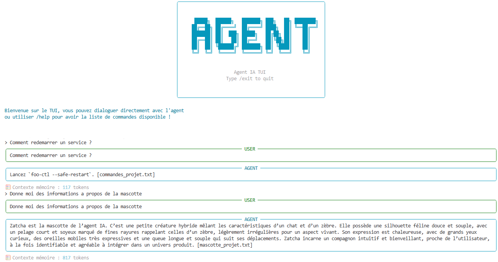

# Agent IA (WIP)

<p align="center">
  
  
  
  
  
</p>

> **Agent IA conversationnel basé sur l'utilisation d'outils (tool-calling), piloté depuis une interface terminal (TUI).** L'agent dialogue avec un LLM, appelle des outils distants via le protocole **MCP**, conserve une **mémoire long terme** entre les sessions et **apprend de ses erreurs d'outil**.

---

## 📋 Sommaire

- [✨ Fonctionnalités](#-fonctionnalités)
- [🏗️ Architecture](#️-architecture)
- [🧠 Mémoire Dual-Brain](#-mémoire-dual-brain)
- [🎓 Apprentissage (RAG de leçons)](#-apprentissage-rag-de-leçons)
- [🗂️ Structure du dépôt](#️-structure-du-dépôt)
- [🚀 Démarrage rapide](#-démarrage-rapide)
- [⚙️ Configuration](#️-configuration)
- [🧭 Commandes TUI](#-commandes-tui)
- [🛠️ Scripts utilitaires](#️-scripts-utilitaires)
- [🧪 Tests](#-tests)
- [🧱 Stack technique](#-stack-technique)

---

## ✨ Fonctionnalités

- 🤖 **Agent tool-calling** orchestré avec LangGraph / LangChain (`create_agent`).
- 🔌 **Outils via MCP** : connexion à un ou plusieurs serveurs MCP, rechargement à chaud, isolation des erreurs par serveur.
- 🧠 **Mémoire dual-brain** :
  - Résumé compact persisté (SQLite) déclenché par seuil de tokens.
  - Faits atomiques catégorisés indexés en vectoriel (ChromaDB) et récupérés par similarité (RAG), avec seuil de pertinence et dédoublonnage sémantique.
- 📚 **RAG de connaissances** (optionnel) : injecte des connaissances de référence (doc, pages web) ingérées hors-ligne dans une collection ChromaDB distincte, en lecture seule, avec citation de la source.
- 🎓 **Apprentissage non paramétrique** : quand un outil échoue puis se corrige, l'agent en tire une leçon stockée dans un RAG global (ChromaDB) et réinjectée aux requêtes similaires, pour ne pas refaire la même erreur — sans ré-entraînement du modèle.
- 🔁 **Multi-provider LLM** commutable à chaud : OpenRouter, OpenAI, Ollama (local).
- 💻 **TUI riche** : panneaux `rich`, complétion et historique `prompt-toolkit`, commandes slash.
- ⏳ **Retour visuel** : spinners pendant l'attente de l'agent et les phases de mémoire, affichage de la réponse **avant** la mémorisation, compteur de tokens du contexte mémoire après chaque réponse.
- 🔁 **Résilience & auto-correction** : erreur d'outil → renvoyée au modèle comme observation pour qu'il se corrige dans le tour ; erreur MCP (transport) → rechargement automatique des outils + nouvelle tentative ; erreur LLM → propagée proprement.




---

## 🏗️ Architecture

Le dépôt est un **monorepo Python** composé de trois sous-projets indépendants, chacun géré par **Poetry** :

```
AgentAuditIA/
├── Agent_IA/     # Cœur de l'agent, mémoire, client MCP et TUI
├── MCP_Server/   # Serveur d'outils FastMCP avec auth et logs
└── Script/       # Scripts utilitaires (nettoyage, ingestion RAG)
```

### Vue d'ensemble

```
┌─────────────────────────────────────────────────────────┐
│                      Agent_IA (TUI)                     │
│                                                         │
│   ┌──────────┐    ┌──────────┐    ┌──────────────────┐  │
│   │  prompt  │──▶│ AgentLG   │──▶│  LLM Provider    │  │
│   │ toolkit  │    │(LangGraph│    │ OpenRouter/OAI/  │  │
│   └──────────┘    │ graph)   │    │    Ollama        │  │
│                   └────┬─────┘    └──────────────────┘  │
│                        │                                │
│              ┌─────────┴──────────┐                     │
│              │                    │                     │
│   ┌──────────▼──────┐   ┌─────────▼────────┐            │
│   │  SessionMemory  │   │  MCPClientWrapper│            │
│   │  (dual-brain)   │   │  (tool-calling)  │            │
│   │                 │   └────────┬─────────┘            │
│   │ SQLite (résumé) │            │                      │
│   │ ChromaDB (faits)│            │  HTTP / MCP          │
│   │ ChromaDB (docs) │            ▼                      │
│   │ ChromaDB (leçons)│   ┌────────────────┐             │
│   └─────────────────┘    │   MCP_Server   │             │
│                          │  (FastMCP)     │             │
│                          └────────────────┘             │
└─────────────────────────────────────────────────────────┘
```

### Flux d'un tour de conversation

1. L'utilisateur saisit un message dans la TUI.
2. `AgentLG.run()` construit le contexte mémoire (résumé + faits RAG + connaissances de référence + leçons apprises pertinentes).
3. Le graphe LangGraph invoque le LLM avec les outils MCP disponibles.
4. Si le LLM appelle un outil, `MCPClientWrapper` exécute la requête sur le `MCP_Server`. En cas d'erreur d'outil, le message est renvoyé au modèle comme observation pour qu'il se corrige.
5. La réponse est affichée **avant** la mémorisation (UX réactive).
6. `MemoryBrain` met à jour le résumé (si seuil tokens dépassé) et extrait les nouveaux faits.
7. Si un outil a échoué pendant le tour, `MemoryBrain.reflect` en tire une **leçon** réutilisable, indexée dans le RAG d'apprentissage.

---

## 🧠 Mémoire Dual-Brain

L'agent conserve deux niveaux de mémoire complémentaires, **isolés par session** :

### Court terme — Résumé (SQLite)
- Les échanges s'accumulent dans un buffer en mémoire.
- Quand le nombre de tokens dépasse **3 000**, un LLM fusionne l'ancien résumé + les nouveaux échanges en un résumé compact.
- Le résumé est persisté dans `persistence_memory/summaries.sqlite`.

### Long terme — Faits (ChromaDB + RAG)
- À chaque résumé, `MemoryBrain.extract_facts` extrait les faits atomiques catégorisés (préférences, contexte projet, décisions...).
- Les faits sont indexés dans **ChromaDB** et récupérés par similarité sémantique (cosinus) au tour suivant.
- **Dédoublonnage** à deux niveaux : par le prompt (`known_facts`) + sémantique à l'indexation.
- **Garde-fou contre la fuite de connaissances** : avant indexation, chaque candidat-fait est comparé au RAG de connaissances de référence ; au-dessus d'un seuil de similarité, il est écarté (un fait ne doit pas être une recopie de la doc).

### RAG de connaissances (optionnel)
- Collection ChromaDB **distincte**, en lecture seule côté agent.
- Alimentée hors-ligne via `Script/ingest_knowledge.py` (`.txt`, `.md`, `.pdf`).
- L'agent cite la source entre crochets (`[fichier]`) dans ses réponses.
- Ingestion **idempotente** : réingérer un fichier remplace ses chunks sans doublon.

```
persistence_memory/
├── summaries.sqlite      # Résumés court terme par session
├── chroma_facts/         # Faits long terme (vectoriel)
├── chroma_knowledge/     # Connaissances de référence (RAG lecture seule)
└── chroma_lessons/       # Leçons apprises des erreurs d'outil (RAG global)
```

---

## 🎓 Apprentissage (RAG de leçons)

Au-delà de la mémoire, l'agent **apprend de ses erreurs d'outil** — sans jamais toucher aux poids du modèle (apprentissage *non paramétrique*).

- **Réflexion** : quand un outil échoue puis se corrige dans le même tour, `MemoryBrain.reflect` analyse la trace et en distille une **leçon** impérative (« pour cet outil, utilise plutôt telle valeur »).
- **Mémorisation** : la leçon est indexée dans une collection ChromaDB **distincte et globale** (`persistence_memory/chroma_lessons/`), partagée par **toutes les sessions**, avec dédoublonnage sémantique.
- **Réinjection** : à une demande similaire, les leçons pertinentes sont réinjectées dans le contexte **avant** que l'agent agisse, pour qu'il évite l'erreur d'emblée.
- **Coût maîtrisé** : la réflexion (appel LLM) ne se déclenche **que** sur erreur d'outil, jamais à vide.
- **Curation** : commande `/lessons` pour inspecter, supprimer ou purger ce que l'agent a retenu.

> Différence avec l'auto-correction : l'auto-correction agit *dans* le tour (le modèle se reprend après une erreur) ; l'apprentissage, lui, évite de **refaire** l'erreur aux tours suivants — et dans n'importe quelle session.

---

## 🗂️ Structure du dépôt

### `Agent_IA/`

```
src/agent_ia/
├── core/
│   ├── agent_lg.py          # AgentLG : orchestrateur principal
│   ├── agent_context.py     # AgentContext : état partagé de session
│   ├── runtime.py           # create_session() : assemblage du contexte
│   ├── logger/              # AgentLogger (niveaux), NullLogger, step_format
│   ├── exceptions/          # ModelTaskError, ToolTaskError
│   └── memory/
│       ├── session_memory.py        # Buffer, résumé, faits, connaissances, leçons
│       ├── memory_brain.py          # LLM dédié : résumé, extraction de faits, réflexion
│       ├── short_memory/            # MemoryStore — persistance SQLite
│       └── rag/
│           ├── retriever.py         # Interface Retriever + RetrievedItem
│           ├── chroma_vector_store.py   # Mécanique cosinus partagée
│           ├── facts_rag/           # VectorFactStore (Chroma)
│           ├── knowledge_rag/       # VectorKnowledgeStore (Chroma, lecture seule)
│           └── experience_rag/      # VectorExperienceStore (Chroma, leçons globales)
├── llm/
│   ├── llm_factory.py       # Instancie le bon ChatModel selon le provider
│   └── loader.py            # Charge llm_config.yaml
├── mcp/
│   ├── client.py            # MCPClientWrapper : récupère les outils MCP
│   └── loader.py            # Charge mcp_servers_config.yaml
├── config/
│   ├── loader.py            # load_yaml_file()
│   └── paths.py             # Chemins de persistance centralisés
├── debug/
│   └── httpx_patch.py       # Monkey-patch debug des requêtes httpx (optionnel)
└── interfaces/tui/
    ├── main.py              # Point d'entrée TUI, boucle principale
    ├── renderer.py          # TuiRenderer : panneaux rich + escape markup
    ├── completer.py         # Complétion et historique prompt-toolkit
    ├── tui_session.py       # Gestion de la session TUI
    └── commands/
        ├── commands.py      # Définition de toutes les commandes slash
        ├── command_handler.py   # Dispatch et exécution des commandes
        └── registry.py     # Registre des commandes disponibles
```

### `MCP_Server/`
Serveur d'outils **FastMCP** (transport HTTP) avec authentification et logs. Expose les outils appelables par l'agent.

---

## 🚀 Démarrage rapide

### 1. Prérequis

- Python >= 3.11
- [Poetry](https://python-poetry.org/)
- (Optionnel) [Ollama](https://ollama.com/) pour les modèles locaux

### 2. Configuration des secrets

```bash
cp .env.example .env
```

Renseigner dans `.env` :

```env
REFERER=...
PROJECT_NAME=...
OPENAI_API_KEY=...
OPENROUTER_API_KEY=...
```

### 3. Lancer le serveur MCP

```bash
cd MCP_Server
poetry install
poetry run serv      # écoute sur http://0.0.0.0:1235/mcp
```

### 4. Lancer l'agent (TUI)

```bash
cd Agent_IA
poetry install
poetry run agent
```

---

## ⚙️ Configuration

### LLM — `Agent_IA/config/llm_config.yaml`

```yaml
default_provider: openrouter
providers:
  openrouter:
    model: openai/gpt-oss-120b:free
    base_url: https://openrouter.ai/api/v1
  openai:
    model: gpt-4o-mini
  ollama:
    model: qwen3:8b
    base_url: http://localhost:11434
```

### Serveurs MCP — `Agent_IA/config/mcp_servers_config.yaml`

Transport, URL et headers (auth / identité de l'agent) de chaque serveur MCP à connecter.

---

## 🧭 Commandes TUI

| Commande | Description |
|---|---|
| `/help` | Liste les commandes disponibles. |
| `/status` | Affiche session, provider, modèle, outils chargés, mode debug. |
| `/tools [reload]` | Liste les outils MCP, ou les recharge à chaud. |
| `/facts [clear \| rm <n>...]` | Liste les faits mémorisés, supprime ceux ciblés ou efface toute la mémoire. |
| `/lessons [clear \| rm <n>...]` | Liste les leçons apprises des erreurs d'outil, supprime celles ciblées ou les efface toutes. |
| `/session [list \| <id> \| rm <id>]` | Liste les sessions, bascule sur une session (créée si inconnue), ou supprime. |
| `/provider [nom]` | Affiche ou change le provider LLM à chaud. |
| `/model [nom]` | Affiche ou change le modèle LLM à chaud. |
| `/debug <on\|off>` | Active/désactive le mode debug (streaming + logs détaillés). |
| `/exit` | Quitte et déclenche un résumé final de la mémoire. |

Toute autre saisie est envoyée directement à l'agent.

---

## 🛠️ Scripts utilitaires

```bash
# Nettoyer les caches Python
python ./Script/clean_cache.py

# Ingérer des connaissances de référence dans le RAG (.txt / .md / .pdf)
# Idempotent : réingérer un fichier remplace ses chunks sans doublon
cd Agent_IA && poetry install          # ajouter --extras pdf pour le support PDF
python ./Script/ingest_knowledge.py <fichier_ou_dossier>
python ./Script/ingest_knowledge.py --list              # inventaire des sources
python ./Script/ingest_knowledge.py --delete <source>   # retire une source
python ./Script/ingest_knowledge.py --reset <dossier>   # repart d'un corpus vide
```

---

## 🧪 Tests

```bash
cd Agent_IA
poetry run pytest
```

Les tests couvrent notamment :
- La détection et le filtrage de la fuite de connaissances de référence vers les faits (`test_session_memory_leak.py`).
- Le RAG de connaissances : idempotence, indépendance des sources, `delete_source`, `reset` (`test_knowledge_store.py`).
- L'apprentissage : indexation et dédoublonnage des leçons (`test_experience_store.py`), réflexion sur erreur d'outil (`test_session_memory_reflect.py`), formatage de la trace d'étapes et détection d'erreur (`test_step_format.py`).
- L'auto-correction sur erreur d'outil (`test_tool_error_handling.py`).
- Les tests d'intégration agent (`test_agent.py`) nécessitent un LLM accessible.

---

## 🧱 Stack technique

| Catégorie | Outils |
|---|---|
| Orchestration agent | LangGraph · LangChain · `create_agent` |
| Protocole outils | FastMCP · langchain-mcp-adapters |
| LLM providers | OpenRouter · OpenAI · Ollama |
| Mémoire court terme | SQLite (`aiosqlite`) |
| Mémoire long terme | ChromaDB (vectoriel, cosinus) |
| Apprentissage | ChromaDB (leçons globales, non paramétrique) |
| TUI | `rich` · `prompt-toolkit` |
| Config | YAML (`pyyaml`) · `python-dotenv` |
| Tests | `pytest` · `pytest-asyncio` |
